# 🚀 Borstak – Marketplace App for Properties & Cars

  <b>A modern Flutter marketplace connecting buyers, sellers, and agencies in one seamless platform.</b>

  
  
  
  

---

## 📲 Download App

  

---

## 📌 Overview

**Borstak** is a production-ready Flutter marketplace application that connects **property and car owners** with **buyers and agencies** in a seamless digital experience.

The platform allows users to:

* List properties or vehicles
* Search using advanced filters
* Receive customized offers from agencies
* Chat directly after accepting offers

The app is designed with **performance, scalability, and user experience** in mind.

---

## ✨ Key Features

### 👥 Multi-User Roles

* 👤 **Users (Seekers)**: Browse, search, and create listings
* 🛒 **Buyers**: Find suitable properties or vehicles
* 🏢 **Agencies**: Respond to requests and send offers

---

### 📦 Listings Management

* Create & manage listings
* Upload images and detailed descriptions
* Structured marketplace browsing

---

### 🔍 Advanced Search

* Powerful filtering system
* Search based on:

  * Price 💰
  * Location 📍
  * Category 🏷️
  * Specifications ⚙️

---

### 🔁 Request & Offer System

* Users submit requests
* Agencies send matching offers
* 🔔 Instant notifications when an offer is received

---

### 💬 Real-Time Chat

* Built-in chat system
* Starts after offer acceptance
* Smooth communication experience

---

### ❤️ Favorites

* Save listings for quick access later

---

### 🔔 Push Notifications

* Instant alerts for:

  * Offers
  * Messages
  * Updates

---

## 🏗️ Architecture

Built using scalable and maintainable principles:

### 🔧 Architecture Principles

* Feature-based structure
* Clean Architecture
* Separation of concerns
* Scalable codebase

---

### 🧠 Tech Stack

* Flutter
* Dart
* RESTful APIs
* Bloc / Cubit
* Dio

---

## ⚡ Technical Highlights

* Advanced filtering system
* Multi-role dynamic flows
* Notification-driven UX
* API-driven architecture
* Modular scalable structure

---

## 📱 Screenshots

### 👤 User (Seeker)

  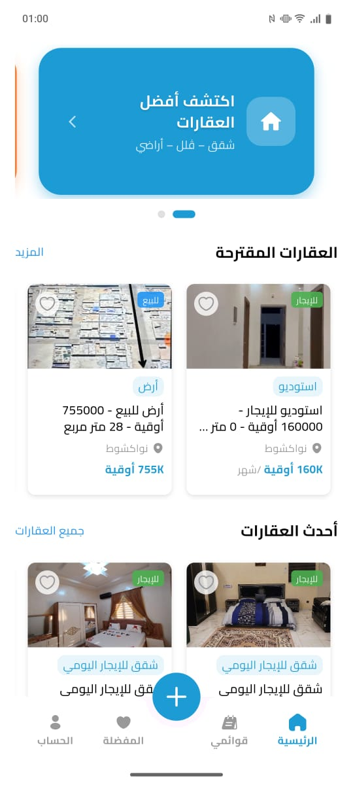
  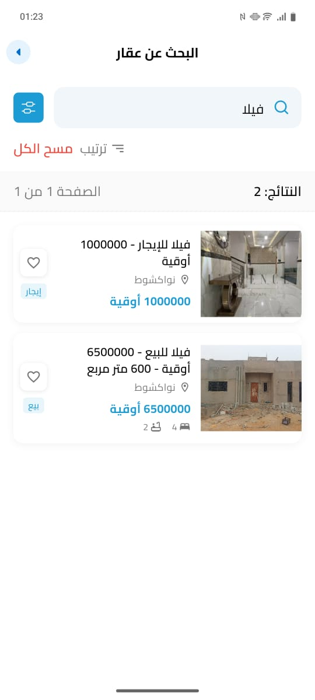
  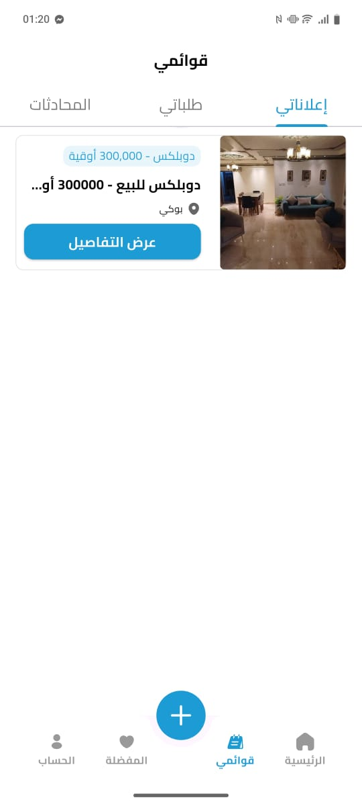

  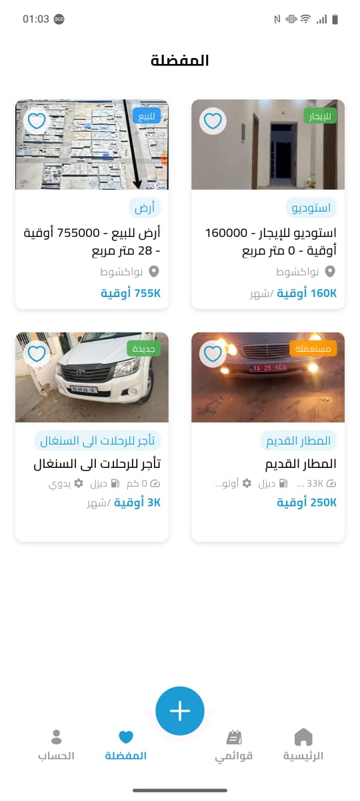
  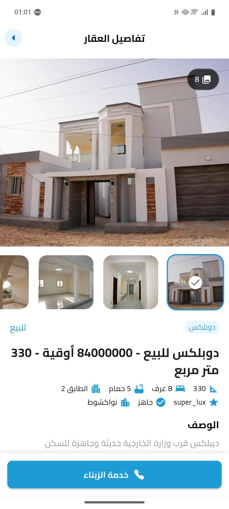

---

### 🚗 Create Car Flow

  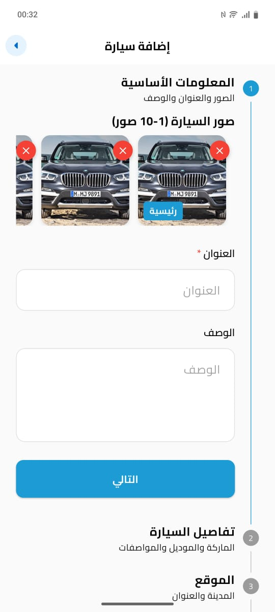
  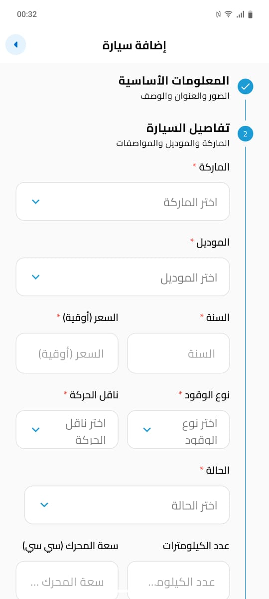
  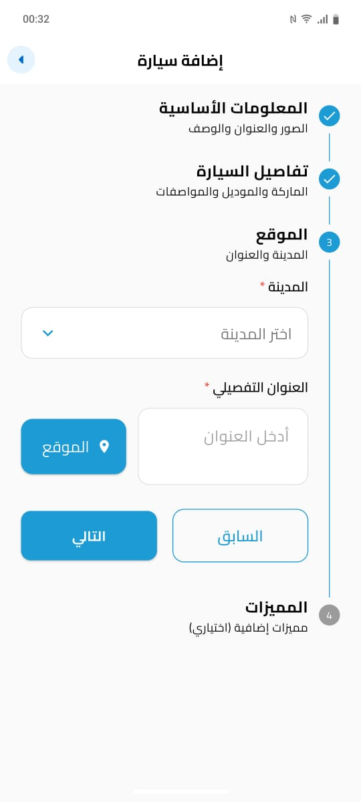
  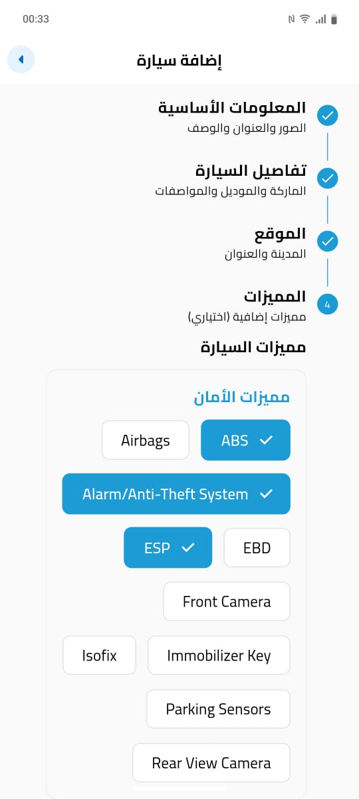

  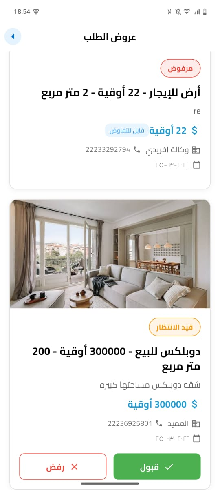
  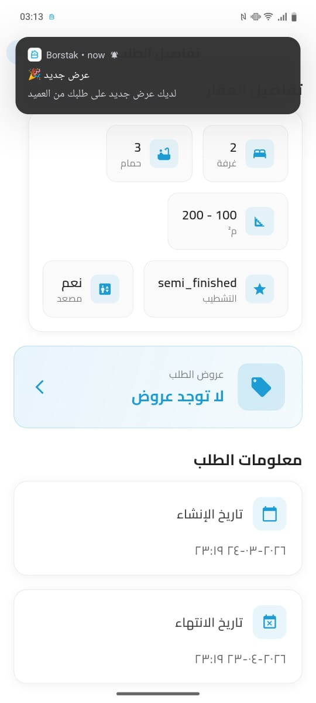

---

### 🏢 Agency

  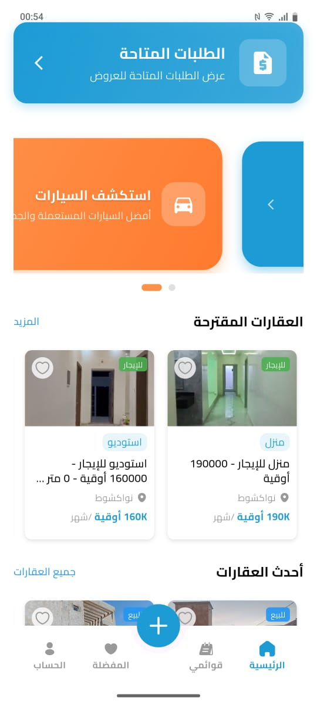
  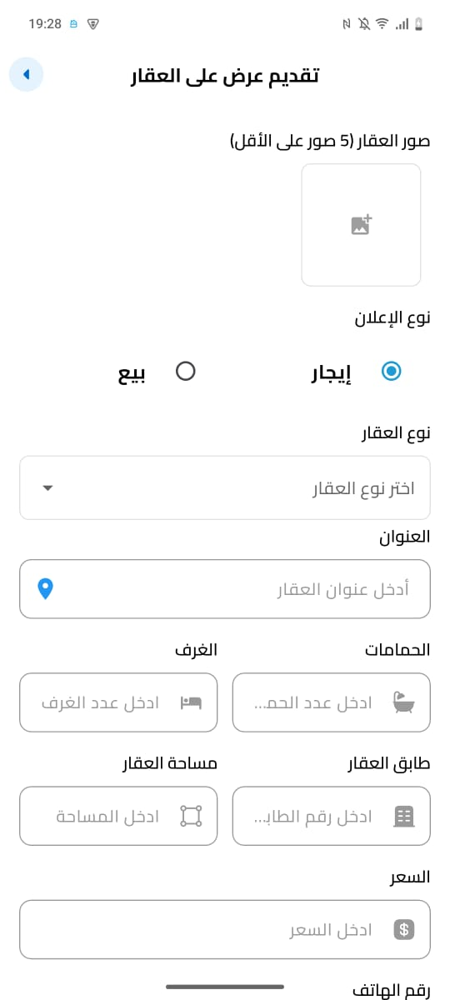
  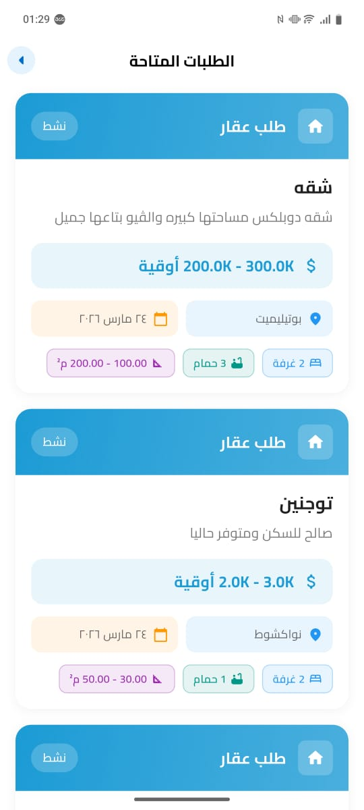

---

### 💬 Chat

  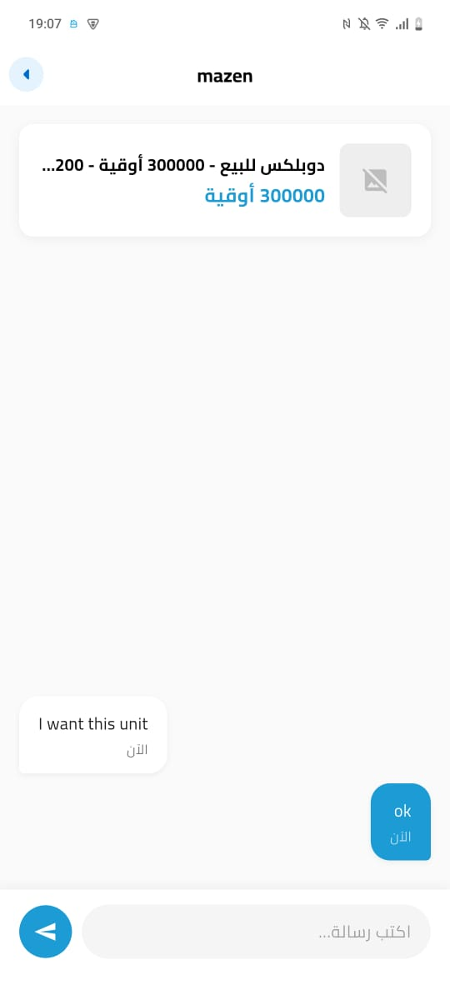

---

## 👨‍💻 Developer

**Mazen Tarek**
Flutter Developer

🔗 GitHub:
https://github.com/MazenTarek24

---

## 📌 Notes

* This project represents a **real production-level application**
* Source code is **private** due to ownership
* Focus is on:

  * Architecture
  * Features
  * UI/UX quality

---

## ⭐ Support

If you like this project, give it a ⭐ on GitHub!
